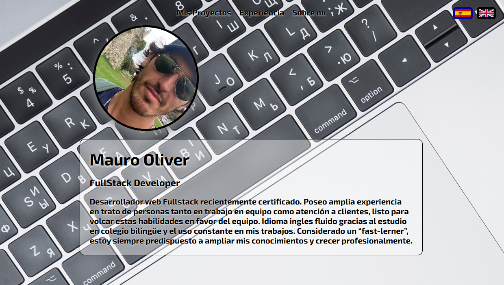

## Hi there, I'm Mauro 👋

### 👨🏻‍💻  About Me

📠 I am Currently certificated as Full Stack Web Developer from Hack A Boss.\
💡  I like to explore new technologies and develop software solutions.\
👨‍💻  I'm searching for a job where I can develop my new acquired skills.\
🌱  Always looking forward to personal growth and learning both hard and soft skills.\
✍️  Well experienced on people treatment and team work, I consider myself with leadership capacity, always looking for nice working enviroments.\
💬  Sports enthusiast.\
✉️  You can email me at olivermauro@outlook.com! I'll try to respond as soon as I can.\
📄  Please have a look at my [LinkedIn](https://www.linkedin.com/in/moliverg/) for more details about me.

### 🔗  My Portfolio

    

### 🛠 &nbsp;Tech Stack

&nbsp;
&nbsp;
&nbsp;
&nbsp;
&nbsp;
&nbsp;
&nbsp;
&nbsp;
&nbsp;
&nbsp;
&nbsp;

### 🗃 &nbsp;Databases

&nbsp;
&nbsp;

### 🧰 &nbsp;Version Controll & Tools 

&nbsp;
&nbsp;
&nbsp;
&nbsp;
&nbsp;
&nbsp;
&nbsp;

### ⚙️ &nbsp;GitHub Analytics

    

<!-- 

    

 -->
<!--
### ⚙️ &nbsp;GitHub Analytics

  
  

  

### 🎖 &nbsp;My Badges 

### 📜 &nbsp;My Articles

### 💰 &nbsp;Support My Work
 

### 🤝🏻 &nbsp;Connect with Me

### 🐍 &nbsp;That's How Commits move ...

  

-->
